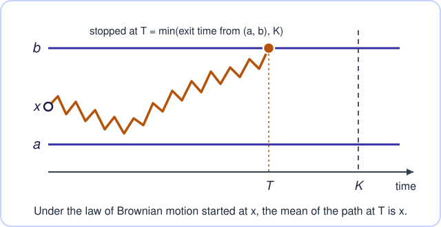

<div align="center">
  
  <h1>MarkovProcess consumer pilot</h1>
  <p><strong>A small Lean 4 project that uses Scott Armstrong's
  <a href="https://github.com/scottnarmstrong/MarkovProcess">MarkovProcess</a>
  library to prove optional stopping for Brownian motion at a truncated exit time.</strong></p>

  <p>
    <a href="https://github.com/chenle02/markovprocess-pilot/actions/workflows/ci.yml"></a>
    <a href="https://github.com/scottnarmstrong/MarkovProcess"></a>
    <a href="lean-toolchain"></a>
    <a href="docs/reproducing.md#receipts"></a>
    <a href="LICENSE"></a>
    <a href="https://github.com/sponsors/chenle02"></a>
  </p>

  <p>
    <a href="#the-result"><strong>The result</strong></a>
    · <a href="#quick-start">Quick start</a>
    · <a href="docs/proof-outline.md">Proof outline</a>
    · <a href="docs/reproducing.md">Reproducing and evidence</a>
    · <a href="#citing">Citing</a>
    · <a href="llms.txt">LLM index</a>
  </p>
</div>

> [!NOTE]
> **Credit.** This pilot is a thin consumer of Scott Armstrong's
> [MarkovProcess](https://github.com/scottnarmstrong/MarkovProcess), which did
> the heavy lifting: the canonical Brownian motion, exit times, the heat
> generator, Feller regularity, continuous-time optional stopping and
> Dynkin's formula. This repository adds about 250 lines on top (a bridge to
> Mathlib's Brownian motion, a test function and the final assembly), and one
> helper lemma is adapted from MarkovProcess with Armstrong's copyright notice.
> It is a pilot, not a general library. If you use it, please
> [cite MarkovProcess](#citing).

## The result

<p align="center">
  
</p>

**Headline theorem.** Brownian motion started at `x ∈ (a, b)` and stopped at
its exit time from `(a, b)`, truncated at any deterministic horizon `K`, has
mean `x`:

```lean
theorem MarkovProcessPilot.integral_eval_exitTimeTrunc_Ioo
    (a b x : ℝ) (hax : a < x) (hxb : x < b) (K : ℝ≥0) :
    ∫ ω, ω (MarkovProcess.ContinuousPath.exitTimeTrunc (Set.Ioo a b) K ω)
      ∂(MarkovProcess.brownianMotion x) = x
```

**Bridge to Mathlib.** `MarkovProcessPilot.isBrownianReal_iff` shows that
`MarkovProcess.IsBrownianReal X P ↔ ProbabilityTheory.IsBrownianReal X P` for
every process `X` and measure `P`, so the library's Brownian motion is a
Brownian motion in Mathlib's sense once recentred at its starting point
(`isBrownianReal_brownianMotion`), and
Mathlib's Brownian API applies to it.

**Mathlib-only statement check.** `lake comparator` confirms that the theorem
`exit_mean` in [`Audit/Exit/Challenge.lean`](Audit/Exit/Challenge.lean),
stated in Mathlib's vocabulary only (any law on `C(ℝ≥0, ℝ)` that is Brownian
started at `x`, with Mathlib's `hittingBtwn` as the stopping time), is
exactly what [`Audit/Exit/Solution.lean`](Audit/Exit/Solution.lean) proves.

> [!IMPORTANT]
> **Scope.** The exit time is **truncated at `K`**. Untruncated exit times,
> and the exit probability `P_x(exit at b) = (x - a)/(b - a)`, are out of scope
> and not claimed. The mathematics is classical; what this repository
> contributes is a machine-checked consumer of MarkovProcess, not a new
> theorem.

| Check | Status |
|---|---|
| Build | `lake build` green at Lean `v4.35.0-rc2`, Mathlib `065356127b1d` |
| Placeholders | no `sorry`, `admit`, custom `axiom` or `native_decide` in `MarkovProcessPilot/` |
| Axioms | `propext`, `Classical.choice`, `Quot.sound` only ([`logs/axioms.txt`](logs/axioms.txt)) |
| Comparator | `pass`, toolchain mechanism; con-ron, NanoDa and Lean kernels |
| Receipts | [`.lean-receipts/`](.lean-receipts/), bound to commit [`05d99d75df82`](https://github.com/chenle02/markovprocess-pilot/tree/05d99d75df8235e79902220f0fe13e07e81867ca) |
| Index | listed in the lean-pkg package index at that pin, trust level `comparator` |

## Quick start

```bash
git clone https://github.com/chenle02/markovprocess-pilot.git
cd markovprocess-pilot
lake update                         # once; fetches packages and the Mathlib cache
lake exe cache get                  # Mathlib oleans (no-op if already fetched)
lake build                          # builds MarkovProcess from source, then the pilot
lake env lean scripts/Axioms.lean   # prints the axioms of the main declarations
```

MarkovProcess ships no olean cache, so its 250 modules compile on the first
build: about 3.5 minutes on 4 cores and 1.5 GB peak memory per process
([measured](docs/reproducing.md#build-cost-measured-on-a-laptop-2026-10-05)).
`lake build Audit` builds the comparator challenge and solution.

## Find your way

| You want to | Go to |
|---|---|
| Understand the proof and what came from MarkovProcess | [docs/proof-outline.md](docs/proof-outline.md) |
| Rebuild, check pins, axioms and receipts | [docs/reproducing.md](docs/reproducing.md) |
| Read the Lean source | [`MarkovProcessPilot/BrownianExit.lean`](MarkovProcessPilot/BrownianExit.lean) |
| Machine-readable claims | [`claims.yaml`](claims.yaml) |
| Point a coding agent at the repository | [`llms.txt`](llms.txt) and [`AGENTS.md`](AGENTS.md) |
| Report a problem | [open an issue](https://github.com/chenle02/markovprocess-pilot/issues/new/choose) |

## Repository map

```text
MarkovProcessPilot/BrownianExit.lean   the bridge and the exit-time theorem (namespace MarkovProcessPilot)
MarkovProcessPilot.lean                umbrella import
Audit/Exit/{Challenge,Solution}.lean   comparator statement (Mathlib only) and its proof
Audit/Smoke/                           comparator smoke test on a trivial statement
comparator/                            comparator configurations
scripts/Axioms.lean                    #print axioms for the main declarations
.lean-receipts/                        lower-tier and comparator receipts, bound to source commits
claims.yaml                            machine-readable claims (schema claims/1)
logs/                                  build, cache and axiom logs
docs/                                  proof outline, reproduction notes, images
```

## Citing

This pilot is a thin layer over Scott Armstrong's MarkovProcess, which did the
hard part. If you use it, please cite **MarkovProcess** as its
[`CITATION.cff`](https://github.com/scottnarmstrong/MarkovProcess/blob/main/CITATION.cff)
asks. This repository's [`CITATION.cff`](CITATION.cff) names MarkovProcess as
the preferred citation, so GitHub's "Cite this repository" button shows it.
To refer to the pilot itself, cite the repository URL together with commit
`05d99d75df82`, the commit its receipts cover; there is no tagged release.

## Support

If this work is useful to you, you can
[sponsor Le Chen on GitHub](https://github.com/sponsors/chenle02).
Sponsorship does not change what is claimed here or how it is checked. To
support MarkovProcess, star and cite
[Armstrong's repository](https://github.com/scottnarmstrong/MarkovProcess).

## License

Apache-2.0, see [`LICENSE`](LICENSE). MarkovProcess (Apache-2.0, Scott
Armstrong) and Mathlib (Apache-2.0) are dependencies, not vendored, except one
lemma adapted from MarkovProcess (`mem_of_lt_exitTimeTrunc`; its notice is in
[`MarkovProcessPilot/BrownianExit.lean`](MarkovProcessPilot/BrownianExit.lean)).

Maintained by [Le Chen](https://webhome.auburn.edu/~lzc0090/), Department of
Mathematics and Statistics, Auburn University.
